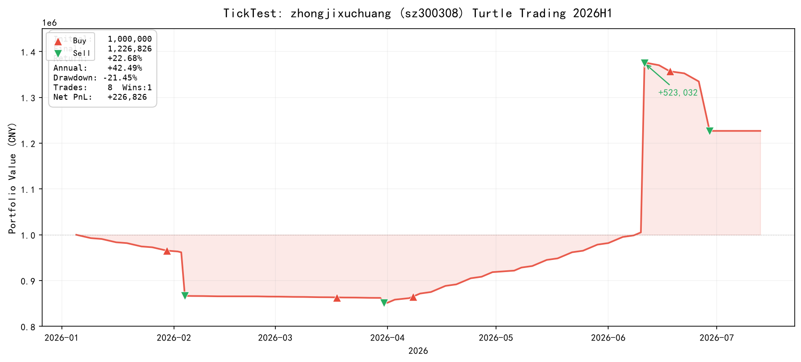
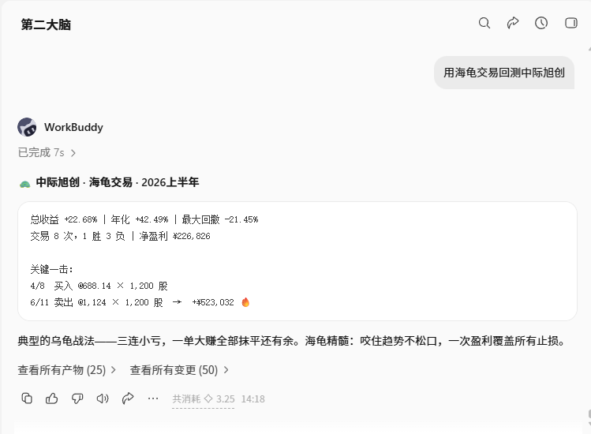

# 🐢 TickTest — A 股量化回测 MCP Server

> 让 AI Agent 用自然语言回测 A 股。说一句话，秒出结果。

[](https://github.com/modelcontextprotocol/servers)
[](https://mcpservers.org/server/shaka-gold/ticktest-mcp-v1)
[](https://smithery.ai/server/shaka-gold/ticktest-mcp-v1)
[](https://pypi.org/project/ticktest-mcp/)
[](LICENSE)

> ⚡ 没有 API Key？Agent 会自动帮你注册——四步、免费、无需离开终端。注册即送 500 信用点。

---

## ⚡ 一行配置

Python 3.10+，一行命令完成安装：

```bash
pip install ticktest-mcp
```

把下面这段贴进 Claude Code 的 `.claude/settings.json`：

```json
{
  "mcpServers": {
    "ticktest": {
      "command": "python",
      "args": ["-m", "ticktest_mcp"],
      "env": {
        "TICKTEST_API_KEY": "tt_your_key_here"
      }
    }
  }
}
```

重启 Claude Code，然后直接说：

> *"帮我用海龟交易回测中际旭创"*

Agent 会搜索 `sh600519` → 回测 → 返回收益率、夏普比率、最大回撤、胜率等六大指标。**海龟交易永久免费**。

> 📍 也支持 ChatGPT、Cursor、Windsurf、腾讯 ADP — 任何兼容 MCP 的客户端。也可通过 [Smithery](https://smithery.ai/server/shaka-gold/ticktest-mcp-v1) 零安装使用。


---

## 📸 Demo

> 用户说「帮我用海龟交易回测中际旭创」，Agent 自动搜索 → 回测 → 六大指标，全程自然语言，零代码。





---

## 🔑 获取 API Key

无需离开对话，Agent 帮你完成注册：

1. Agent 询问邮箱 → 调用 `send-code` → 邮件收到 6 位验证码
2. 告诉 Agent 验证码 → 注册成功 → 拿到 **API Key + 500 信用点**（≈ 20 次回测）

没有 Key 也能用 4 个免费 Tool：`get_capabilities` / `health_check` / `search_symbols` / `validate_strategy`

---

## 🛠 6 个 Tools

| Tool | Key | 说明 |
|:-----|:---|:-----|
| `get_capabilities` | ❌ | 策略、因子、定价、股票范围 |
| `health_check` | ❌ | 检查 API 服务状态 |
| `search_symbols` | ❌ | 中文名 → 股票代码 |
| `validate_strategy` | ❌ | 免费校验策略参数 |
| `run_backtest` | ✅ | 运行回测，**¥0.50/次** |
| `create_payment` | ✅ | 双通道支付（支付宝扫码） |

---

## 💰 定价

| 套餐 | 价格 | 内容 |
|:-----|:-----|:-----|
| 🐢 海龟交易 | **永久免费** | 不限次数 |
| 🎁 注册赠送 | ¥0 | 500 信用点 ≈ 20 次 |
| 🔄 单次 | ¥0.50 | 1 次回测 |
| ⭐ 入门 | ¥29/月 | 2500 点 ≈ 100 次 |

---

## 🌐 环境变量

| 变量 | 必填 | 默认值 |
|:-----|:-----|:-----|
| `TICKTEST_API_URL` | 否 | `https://api.ticktest.cn` |
| `TICKTEST_API_KEY` | 否 | 空（只能调公开 Tool） |

---

## 📚 链接

- 官网：[ticktest.cn](https://ticktest.cn)
- 注册：[ticktest.cn/developer.html](https://ticktest.cn/developer.html)
- Smithery：[smithery.ai/server/shaka-gold/ticktest-mcp-v1](https://smithery.ai/server/shaka-gold/ticktest-mcp-v1)
- PyPI：[pypi.org/project/ticktest-mcp](https://pypi.org/project/ticktest-mcp/)

---

MIT License
